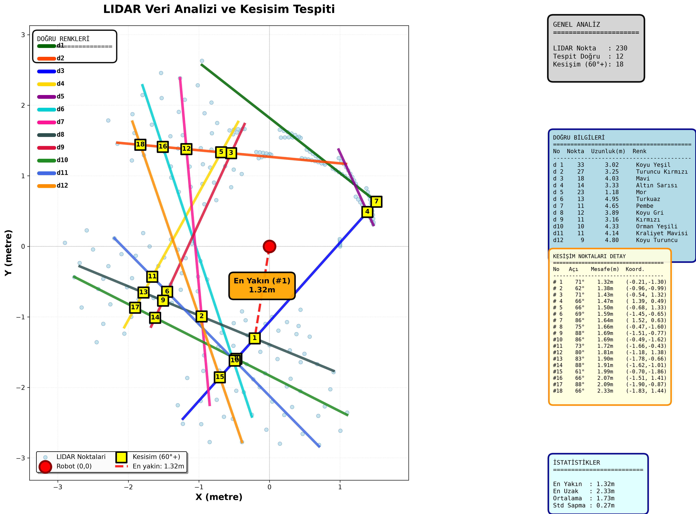
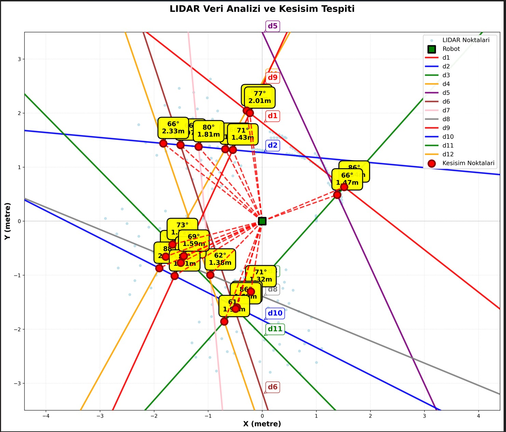

# LiDAR Nokta Bulutu / Duvar Tespiti Analizi

2D LiDAR tarama verisini (TOML formatında) işleyip RANSAC ile duvarları (doğruları) tespit eden, doğrular arası kesişim noktalarını ve robota olan mesafeleri hesaplayan bir C programı; sonuçlar Python/matplotlib ile görselleştirilir.



## Mimari


## Nasıl çalışır

1. **Veri kaynağı seçimi:** program çalışınca yerel `scan_data_nan.toml` dosyası, Kocaeli Üniversitesi'nin sağladığı örnek taramalardan biri (`lidar1.toml`...`lidar5.toml`) ya da elle girilen bir dosya/URL kullanılabilir
2. **RANSAC ile doğru tespiti:** taranan noktalar arasından duvarlara karşılık gelen doğrular RANSAC algoritmasıyla bulunur
3. **Kesişim analizi:** doğrular arası kesişim noktaları ve robota (0,0) olan açı/mesafeleri hesaplanır
4. **Çıktı:** `lidar_data.txt` ve `line_*.dat` / `points.dat` dosyalarına yazılır
5. **Görselleştirme:** `plot_lidar.py`, bu verileri okuyup `lidar_plot.png` olarak bir analiz grafiği üretir

## Teknoloji

- C (Winsock/BSD sockets ile HTTP indirme, RANSAC doğru uydurma)
- Python (numpy, matplotlib) — görselleştirme
- gnuplot (`plot_commands.gnu`) — alternatif çizim

## Derleme ve çalıştırma

Windows (MSVC/MinGW, winsock2 ile):

```bash
gcc lidar_analiz.c -o lidar_analiz.exe -lws2_32
lidar_analiz.exe
```

Linux/macOS:

```bash
gcc lidar_analiz.c -o lidar_analiz
./lidar_analiz
```

Ardından grafiği oluşturmak için:

```bash
pip install numpy matplotlib
python plot_lidar.py
```

## Belgeler

- `lidar_plot.png`, `line_*.dat`, `points.dat` — örnek bir çalıştırmadan kalan örnek çıktılar

Farklı bir veri seti ile alternatif bir çalıştırma örneği:


