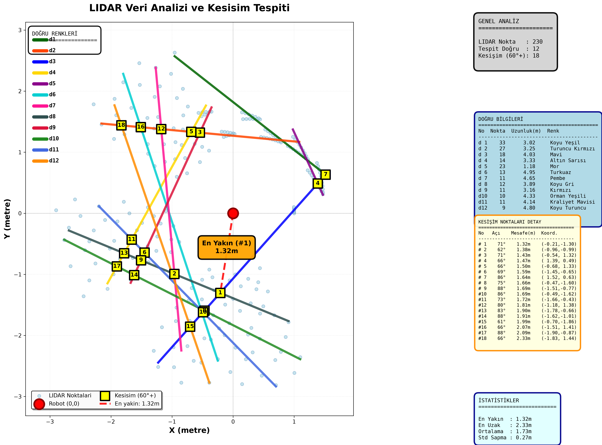
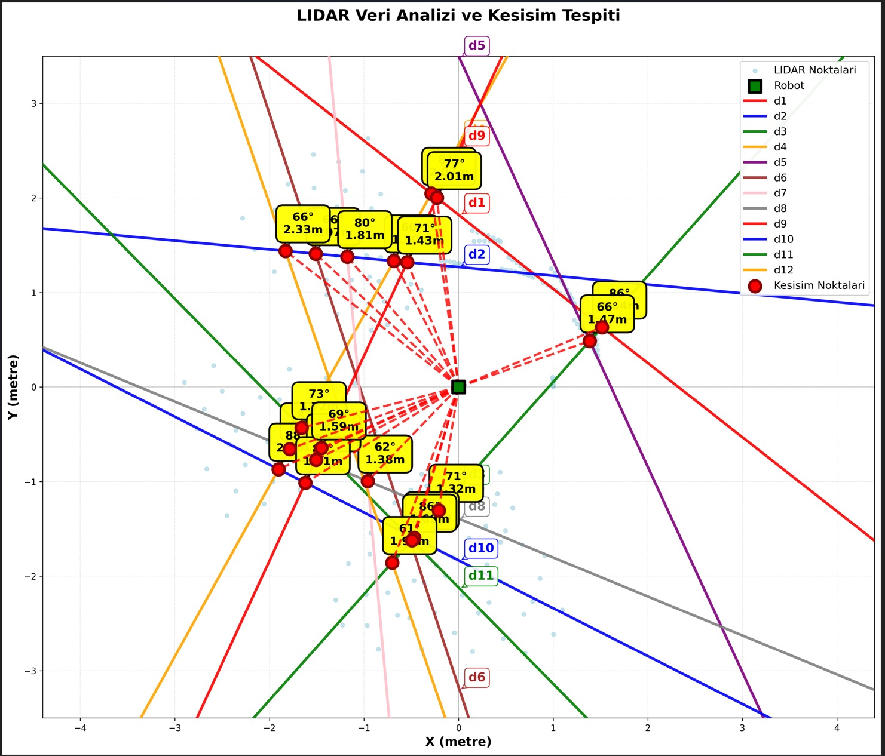

# LiDAR Nokta Bulutu Analizi

2D LiDAR tarama verisinden (TOML formatında) duvarları RANSAC ile bulan C programı. Bulunan doğruların kesişim noktalarını ve robota olan açı ve mesafeleri de hesaplıyor. Sonuçlar Python ile çizdiriliyor.



## Nasıl çalışıyor

1. Program açılınca veri kaynağı soruluyor: yerel `scan_data_nan.toml`, Kocaeli Üniversitesi'nin verdiği örnek taramalardan biri (`lidar1.toml` ... `lidar5.toml`) ya da elle girilen bir dosya veya adres
2. Noktalar arasından duvarlara denk gelen doğrular RANSAC ile bulunuyor
3. Doğruların kesişim noktaları ve robota (0,0) olan açı ve mesafeleri hesaplanıyor
4. Sonuçlar `lidar_data.txt`, `line_*.dat` ve `points.dat` dosyalarına yazılıyor
5. `plot_lidar.py` bu dosyaları okuyup `lidar_plot.png` grafiğini çiziyor (`plot_commands.gnu` ile gnuplot'ta da çizilebilir)

## Kullanılanlar

C (HTTP ile veri indirmek için Winsock/BSD socket), Python (numpy, matplotlib), gnuplot

## Derleme ve çalıştırma

Windows:

```
gcc lidar_analiz.c -o lidar_analiz.exe -lws2_32
lidar_analiz.exe
```

Linux / macOS:

```
gcc lidar_analiz.c -o lidar_analiz
./lidar_analiz
```

Grafik için:

```
pip install numpy matplotlib
python plot_lidar.py
```

`lidar_plot.png`, `line_*.dat` ve `points.dat` dosyaları bir çalıştırmadan kalan örnek çıktılar.

Başka bir veri setiyle çalıştırma:


